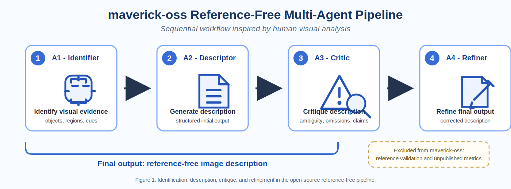

# maverick-oss

## Overview

**maverick-oss** is a fully open-source, reference-free multi-agent system for generating and refining image descriptions with Vision-Language Models (VLMs). It is a reduced and transparent version of a larger research framework, **MAVERICK: Multi-Agent Validation for Explainable Visual Reasoning and Image Consistency Knowledge**, developed as part of a Master's Thesis in Artificial Intelligence by **Eduardo J. Barrios**.

This repository is designed as a general-purpose research system. It is not limited to any specific application domain and can be adapted to contexts where visual description, interpretability, and iterative reasoning are relevant.

maverick-oss includes only the reference-free pipeline. It does not include reference-based validation, comparison against ground-truth descriptions, or proprietary and unpublished evaluation metrics.

## Cognitive Inspiration

maverick-oss is a general-purpose multi-agent pipeline inspired by human visual reasoning. The system follows a cognitive-inspired workflow in which an image is first examined for salient entities, then described, critically reviewed, and refined.

MAVERICK is inspired by human visual analysis. A person usually begins by identifying the objects, regions, and visual cues present in an image; then they describe what they see using prior knowledge and domain expertise. When there are doubts, ambiguities, or possible inconsistencies, the description is re-examined critically and refined into a more coherent final interpretation. This design is aligned with cognitive research on high-level scene perception, where object identification, scene interpretation, eye movements, and ongoing cognitive processing interact during visual understanding ([Henderson & Hollingworth, 1999](https://doi.org/10.1146/annurev.psych.50.1.243)). maverick-oss operationalizes this process through specialized agents: A1 identifies visual elements, A2 describes them, A3 critiques the description, and A4 refines the final output.

The pipeline is organized around four stages:

1. **Identification**: Detect and name salient visual elements.
2. **Description**: Produce a coherent image description based on the identified elements.
3. **Critique**: Review the description for completeness, clarity, uncertainty, and unsupported claims.
4. **Refinement**: Produce a final improved description based on the critique.

This design is intended to support transparent reasoning, modular experimentation, and reproducible prompt-based research.

## Architecture

maverick-oss contains exactly four configurable agents:



**Figure 1.** maverick-oss implements a sequential reference-free workflow in which A1 identifies visual elements, A2 generates an initial description, A3 critiques the description, and A4 refines the final output.

| Agent | Name | Role |
| --- | --- | --- |
| A1 | Identifier | Identifies salient objects, entities, regions, attributes, and uncertainties in the image. |
| A2 | Descriptor | Generates an initial image description using the structured observations from A1. |
| A3 | Critic | Evaluates the initial description without using any external reference description. |
| A4 | Refiner | Produces the final description by integrating A1 observations, A2 output, and A3 critique. |

Each agent is modular and can be configured independently with its own model, API key, base URL, temperature, and prompt. The implementation uses an OpenAI-compatible chat completion interface so that different providers can be used with the same pipeline abstraction.

## Execution Mode

This repository supports **reference-free execution only**.

The original MAVERICK research framework implemented external text-to-text validation, where generated descriptions could be compared against reference descriptions using novel evaluation metrics. In maverick-oss, only the reference-free model has been open-sourced.

Accordingly, maverick-oss does not compare generated descriptions against reference descriptions. It does not contain reference-based validation modules, external text-to-text validation components, or unpublished evaluation metrics from the full MAVERICK research framework, including metrics such as MSCE. These exclusions are intentional because those components remain part of ongoing research and are not included in this public repository.

## API Requirements

maverick-oss uses an **OpenAI-compatible API** for VLM and language-model calls. Compatible providers may include:

- OpenAI
- llm7.io
- Local OpenAI-compatible endpoints
- Other providers exposing compatible `/chat/completions` APIs

API keys are required for hosted providers. Users must configure their own credentials and endpoints before running the pipeline. Credentials should not be committed to version control.

## Configuration

The default configuration can be adapted per agent. A minimal configuration has the following structure:

```python
AGENT_CONFIG = {
    "A1": {"api_key": "..."},
    "A2": {"api_key": "..."},
    "A3": {"api_key": "..."},
    "A4": {"api_key": "..."},
}
```

A more complete configuration may specify a provider endpoint and model for each agent:

```python
AGENT_CONFIG = {
    "A1": {
        "api_key": "YOUR_API_KEY",
        "base_url": "https://api.openai.com/v1",
        "model": "gpt-4o-mini",
        "temperature": 0.2,
    },
    "A2": {
        "api_key": "YOUR_API_KEY",
        "base_url": "https://api.openai.com/v1",
        "model": "gpt-4o-mini",
        "temperature": 0.3,
    },
    "A3": {
        "api_key": "YOUR_API_KEY",
        "base_url": "https://api.openai.com/v1",
        "model": "gpt-4o-mini",
        "temperature": 0.2,
    },
    "A4": {
        "api_key": "YOUR_API_KEY",
        "base_url": "https://api.openai.com/v1",
        "model": "gpt-4o-mini",
        "temperature": 0.2,
    },
}
```

Environment variables are also supported:

```bash
OPENAI_API_KEY=your_api_key
OPENAI_BASE_URL=https://api.openai.com/v1
MAVERICK_MODEL=gpt-4o-mini
```

For local endpoints, set `OPENAI_BASE_URL` to the local OpenAI-compatible server URL.

## Prompts

The prompts in this repository are intentionally generic and should be adapted to specific domains.

The included prompts follow SP principles for prompt design. In this repository, SP refers to **structured prompting**: each prompt defines the agent role, task objective, input contract, reasoning procedure, constraints, and expected output format. This makes the pipeline easier to audit, reproduce, and adapt.

The four default prompts are provided in `src/maverick_oss/prompts.py`:

- `A1_IDENTIFIER_PROMPT`
- `A2_DESCRIPTOR_PROMPT`
- `A3_CRITIC_PROMPT`
- `A4_REFINER_PROMPT`

Prompt adaptation should preserve the reference-free constraint. Domain-specific prompts may add terminology or reporting conventions, but they should not introduce reference-description comparison or unpublished evaluation procedures.

## Streamlit UI

maverick-oss includes a minimal Streamlit interface for interactive use.

The interface supports:

- Image upload
- Pipeline execution
- Display of outputs from A1, A2, A3, and A4

Run the interface with:

```bash
streamlit run maverick-oss.py
```

Install dependencies first:

```bash
python -m pip install -r requirements.txt
```

## Open Source Philosophy

This is a simplified version designed to remain fully open-source.

maverick-oss is intended to support transparent and reproducible research. The repository favors clear implementation, explicit configuration, readable prompts, and incremental commits. The project is intentionally minimal so that researchers and developers can inspect, extend, and adapt the system without relying on hidden components.

The public repository excludes unpublished research contributions from the full MAVERICK framework in order to protect ongoing academic work while still providing a useful open-source foundation for multi-agent VLM research.

## License

This project is licensed under the **Mozilla Public License 2.0 (MPL-2.0)**.

Attribution to **Eduardo J. Barrios** is required in derivative works, publications, and redistributed versions of this project. See `LICENSE` for the license notice and terms.

## Author

**Eduardo J. Barrios**  
Master's Thesis in Artificial Intelligence  
Project: maverick-oss

## Citation

If you use maverick-oss in academic or applied work, please cite the repository using the metadata in `CITATION.cff`.

```bibtex
@software{barrios_maverick_oss_2026,
  author = {Barrios, Eduardo J.},
  title = {maverick-oss: A Reference-Free Multi-Agent Pipeline for Image Description with Vision-Language Models},
  year = {2026},
  license = {MPL-2.0}
}
```

## Disclaimer

maverick-oss is a reduced open-source version of the broader MAVERICK research framework. It includes only the reference-free pipeline for image description generation and refinement.

The full MAVERICK system includes additional components for reference-based validation and unpublished evaluation metrics. Those components are part of ongoing research, have not been published, and are not included in this repository.

This repository is provided for research and educational purposes. Users are responsible for validating outputs before applying the system in high-stakes or domain-specific settings.
